<h1>Antoine Quendez</h1>

<b>Développeur full stack · Formateur · Co-fondateur d'Heliara</b> 
Occitanie (Montpellier / Béziers) · mobile France entière

<i>« Je conçois des outils qui s'adaptent au métier, pas l'inverse. »</i>

 

<!-- graphe de contributions animé : vraies données, régénéré chaque jour
     par .github/workflows/update-profile-art.yml -->

<h3><code>antoine@github ~ $ ./contributions.sh</code></h3>

 
 

<!-- portrait : TONE_MAX=0.8 CROP_TOP=0.72 LINE_WEIGHT=1.0 MID_GAMMA=0.4 python scripts/prep_photo.py source-photo.png
                && COLS=130 python scripts/make_ascii_svg.py
     stats :    python scripts/render_stats_svg.py (workflow quotidien) -->

<h3><code>antoine@github ~ $ whoami</code></h3>

<table>
<tr>
<td valign="top"></td>
<td valign="top"></td>
</tr>
</table>

 

## `$ cat about.md`

Développeur full stack TypeScript / React, je travaille du cadrage au déploiement, puis je transmets.

- 🧑‍🏫 **Formateur & développeur web** chez LessonSharing, organisme de formation du groupe Hexceos (cybersécurité, infogérance, hébergement, data, IA)
- 🚀 **Co-fondateur d'[Heliara](https://heliara.fr/)**, la marque du groupe dédiée au sur-mesure : web-apps, ERP, CRM, SaaS, sites, automatisations, IA. J'en ai créé l'identité, le logo, les valeurs et le site.
- 💼 **Développeur indépendant** sous le nom Anthea
- 🎓 **M2 MBA Développeur Full Stack** à MyDigitalSchool Montpellier (licence Concepteur Développeur Web)
- ⚓ **Ancien de la Marine nationale** : rigueur, esprit d'équipe, fiabilité

4 ans de développement, dont un passage en agence web, et 1 an de formation. Je travaille en français et je forme aussi en espagnol.

## `$ ls ./projects`

| Projet | Ce que c'est |
|---|---|
| 🎙️ **Maia** | Agent vocal IA temps réel (STT + LLM + TTS en streaming). Objectif : une plateforme d'agents vocaux auto-hébergée et souveraine, avec des agents configurables (prompt, voix, outils métier) et un prototype d'enceinte connectée. |
| ⚖️ **SaaS d'IA juridique** | Génération documentaire pour un département juridique (contrats, corporate, RH). Modèle d'IA local, hébergement souverain en France, double validation humaine, signature électronique. |
| 🧩 **Plateforme de challenges data / IA** | Pour un hackathon : 20 niveaux de prompt hacking, tokenisation, data. Livrée en Docker avec un LLM local via Ollama. |
| 🏭 **Applications métier sur-mesure** | Gestion pour un négociant automobile (achats en lots, intégration ANTS pour les cartes grises, accès mobile terrain), plateforme interne de centralisation des déplacements professionnels. |
| ✨ **Sites vitrines immersifs** | Storytelling et animations au scroll avec GSAP, ScrollTrigger et Lenis. |

Projets clients anonymisés.

## `$ ls ./stack`

**Front** 

**Back & données** 

**IA** 

**DevOps & qualité** 

## `$ cat method.txt`

**Cadrage → Conception → Construction → Faire durer**

Ateliers de co-conception, gestion de projet, code propre et documenté, données qui restent au client.

## `$ ./teach.sh`

Je conçois et j'anime des formations techniques en entreprise et en centre de formation, notamment **SQL pour non-informaticiens**.

- **Publics** : étudiants, profils métier non techniques, personnes en reconversion, développeurs
- **Pédagogie** : séquençage formalisé, TD/TP sur une base de données fil rouge, quiz web maison, requêtes co-construites en direct
- **Hackathons** data / IA organisés pour des étudiants

## `$ cat values.txt`

`Le métier avant l'outil` · `L'honnêteté, même quand ça dessert` · `Du concret, pas de survente` · `La maîtrise dans la durée` · `La proximité`

 

<h3><code>antoine@github ~ $ ./contact.sh</code></h3>

