 
 

 

### `01` À propos

Je suis développeur full stack TypeScript / React. Je pars du métier pour concevoir l'outil, je le construis, je le déploie, puis je transmets ce que je sais.

|   |   |
|---|---|
| 🧑‍🏫 **Formateur & développeur web** | LessonSharing, organisme de formation du groupe Hexceos |
| ☀️ **Co-fondateur** | [Heliara](https://heliara.fr/), studio de développement sur-mesure : web-apps, ERP, CRM, SaaS, automatisations, IA |
| 💼 **Indépendant** | sous le nom Anthea |
| 🎓 **En formation** | M2 MBA Développeur Full Stack · MyDigitalSchool Montpellier |
| ⚓ **Avant le code** | Marine nationale : rigueur, esprit d'équipe, fiabilité |

 

### `02` Activité

 
 

<!-- portrait : TONE_MAX=0.8 CROP_TOP=0.72 LINE_WEIGHT=1.0 MID_GAMMA=0.4 python scripts/prep_photo.py source-photo.png
                && COLS=130 python scripts/make_ascii_svg.py
     bannière : python scripts/render_header_svg.py
     stats :    python scripts/render_stats_svg.py (workflow quotidien) -->

<table>
<tr>
<td valign="top"></td>
<td valign="top"></td>
</tr>
</table>

 

### `03` Stack

| | |
|---|---|
| **Front** |    |
| **Back & données** |      |
| **IA** |     |
| **DevOps & qualité** |       |

 

### `04` Transmettre

Je conçois et j'anime des formations techniques en entreprise et en centre de formation, principalement autour du **développement web** :

- **Développement** : fondamentaux, front, back, bases de données et SQL
- **Conformité & qualité** : accessibilité RGAA, RGPD, bonnes pratiques
- **SEO & GEO appliqués au dev** : référencement technique et visibilité dans les moteurs IA
- **Concepts IA** : LLM, prompt engineering, usages et limites

Pour des étudiants, des développeurs, des profils métier non techniques et des personnes en reconversion. J'organise aussi des hackathons data / IA pour étudiants. Je forme en français et en espagnol.

 

### `05` Ma façon de travailler

**Cadrage → Conception → Construction → Faire durer**

> Le métier avant l'outil · L'honnêteté, même quand ça dessert · Du concret, pas de survente · La maîtrise dans la durée · La proximité

 

☀️ Occitanie · mobile France entière · graphes régénérés chaque jour par GitHub Actions

